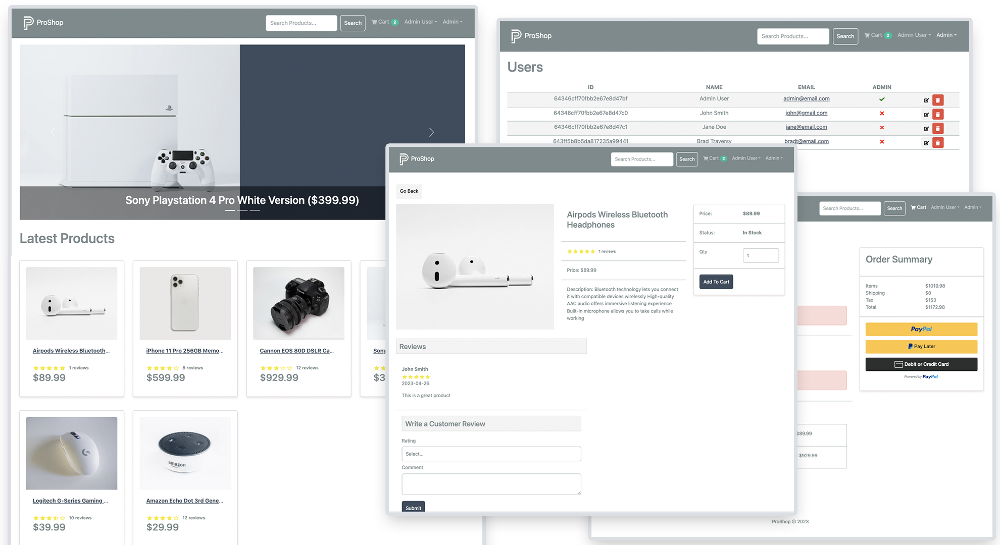

# 🛒 ProShop eCommerce Platform

[](https://www.mongodb.com/mern-stack)
[](https://reactjs.org/)
[](https://nodejs.org/)
[](https://redux-toolkit.js.org/)

ProShop is a modern, full-featured eCommerce platform built with the MERN stack (MongoDB, Express, React, and Node.js). It provides a seamless shopping experience for customers and a robust management suite for administrators.

<div align="center">
  
</div>

---

## 🌟 Key Features

### 👤 Customer Experience
- **Shopping Cart**: Seamlessly add, remove, and update products in a persistent cart.
- **Product Discovery**: Search, filter, and browse products with ease.
- **Reviews & Ratings**: Share feedback and view ratings from other shoppers.
- **Secure Checkout**: Integrated with **PayPal** and credit/debit card payments.
- **Order History**: Track past orders and view detailed order statuses.
- **User Profiles**: Manage account details and shipping information.

### 🔐 Admin Dashboard
- **Inventory Management**: Full CRUD (Create, Read, Update, Delete) operations for products.
- **User Management**: Monitor and manage user accounts.
- **Order Tracking**: View all platform orders and mark them as delivered.
- **Analytics**: High-level overview of platform activity.

---

## 🛠 Tech Stack

| Technology | Purpose |
| :--- | :--- |
| **Frontend** | React, Redux Toolkit, React-Bootstrap, React Router |
| **Backend** | Node.js, Express.js |
| **Database** | MongoDB (Mongoose ODM) |
| **Payments** | PayPal SDK Integration |
| **Authentication** | JWT (JSON Web Tokens) & HTTP-Only Cookies |
| **Storage** | Multer for image uploads |

---

## 🚀 Getting Started

### Prerequisites
- Node.js (v16+)
- MongoDB account (local or Atlas)
- PayPal Developer account (for payment testing)

### 1. Clone & Install
```bash
# Clone the repository
git clone https://github.com/yourusername/proshop.git
cd proshop

# Install backend dependencies
npm install

# Install frontend dependencies
cd frontend
npm install
cd ..
```

### 2. Environment Setup
Create a `.env` file in the root directory and add the following:

```env
NODE_ENV = development
PORT = 5000
MONGO_URI = your_mongodb_connection_string
JWT_SECRET = your_jwt_secret
PAYPAL_CLIENT_ID = your_paypal_client_id
PAGINATION_LIMIT = 8
```

### 3. Run the Application
```bash
# Run both frontend & backend concurrently
npm run dev
```

---

## 🏗 Project Structure

```text
├── backend/          # Express server, routes, and controllers
│   ├── data/         # Sample data for seeding
│   ├── middleware/   # Custom Auth & Error middleware
│   ├── models/       # Mongoose schemas
│   └── routes/       # API endpoints
├── frontend/         # React application
│   ├── public/       # Static assets
│   └── src/          # Components, screens, and Redux slices
└── uploads/          # Local storage for product images
```

---

## 🧪 Database Seeder
To populate your database with sample products and users:

```bash
# Import Data
npm run data:import

# Destroy Data
npm run data:destroy
```

---

## 📄 License
This project is licensed under the MIT License - see the [LICENSE](LICENSE) file for details.

---

<div align="center">
  Built with ❤️ by [Semer Nahdi](https://github.com/SemerNahdi) & Contributed by the community.
</div>
